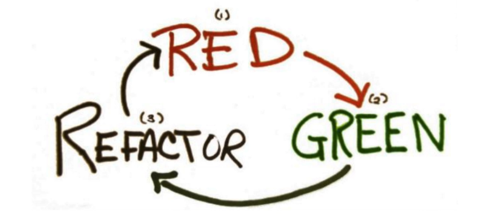

# Testes unitários em JAVA: Domine JUnit, Mockito e TDD
https://www.udemy.com/course/testes-unitarios-em-java/

## Testes Unitários

Os testes unitários avaliam uma das menores porções de código, os métodos.

Podemos criar n testes para esse mesmo método, onde para cada teste colocamos uma entradaa distinta que representa um cenário diferente.

`Entrada + Ação = Resultado`

No contexto de Testes Unitários devemos isolar os relacionamentos externos.

A maioria dos testes podem ser divididos em 3 etapas:
1. **Cenário**: onde as variáveis serão inicializadas, onde toda a config inicial é realizada para que o cenário que desejamos testar esteja disponível. Ou seja, consiguramos o ambiente às entradas necessárias.
2. **Ação**: onde o método que queremos testar seja efetivamente executado. Como fruto dessa etapa teremos o **resultado**, que será usado na última etapa.
3. **Validação**: coletamos o resultado da execução da ação sobre o ambiente e entrada especificado, e esse resultado pode ser um:
    - objeto
    - mensagem de sucesso
    - mensagem de erro
    - alerta 
    - exceção
    - atributo alterado
    - facto de não ser lançado exceção alguma

Na fase 3 (**validação**) é conde comparamos o resultado obtido com o resultado que era esperado para aquela ação sob as condições configuradas na fase inicial.

## Testando sem Ferramenta

Projeto `TestesUnitario`, um sistema para gerenciar os alugéis de filmes de uma locadora.

Princípio `FIRST`: detalhamento sobre o que deve existir para ser um teste unitário.

- `F`ast :: deve ser executado muito rápido ("clica e executa").
- `I`ndependent / `I`solado :: um teste não deve depender de outros, podendo rodar em qualquer ordem.
- `R`epeatable :: pode ser executando quantas vezes quiser e na hora que quiser (deve funcionar e dar sempre o mesmo resultado).
- `S`elf-Verifying :: "alto-verificado", um teste deve saber quando sua execução foi correta e quando falhou.
- `T`imely :: "oportuno", um teste deve ser criado no momento correto.
 
Exemplo de código que testa sem ferramentas de teste, e segue o princípio FIRST.

```java
package br.ce.wcaquino.servicos;

import static br.ce.wcaquino.utils.DataUtils.adicionarDias;

import java.util.Date;

import br.ce.wcaquino.entidades.Filme;
import br.ce.wcaquino.entidades.Locacao;
import br.ce.wcaquino.entidades.Usuario;
import br.ce.wcaquino.utils.DataUtils;

public class LocacaoService {
	
	public Locacao alugarFilme(Usuario usuario, Filme filme) {
		Locacao locacao = new Locacao();
		locacao.setFilme(filme);
		locacao.setUsuario(usuario);
		locacao.setDataLocacao(new Date());
		locacao.setValor(filme.getPrecoLocacao());

		//Entrega no dia seguinte
		Date dataEntrega = new Date();
		dataEntrega = adicionarDias(dataEntrega, 1);
		locacao.setDataRetorno(dataEntrega);
		
		//Salvando a locacao...	
		//TODO adicionar método para salvar
		
		return locacao;
	}

	public static void main(String[] args) {

		// Cenario :: inicializar tudo o que precisamos
		LocacaoService service = new LocacaoService(); // instancia da classe que quero testar
		Usuario usuario = new Usuario("Usuario 1");
		Filme filme = new Filme("Filme 1", 2, 5.0);

		// Acao :: execução metodo que quero testar
		Locacao locacao = service.alugarFilme(usuario, filme);

		// Validacao :: checar se o resultado da ação está de acordo com o esperado
		System.out.println(locacao.getValor() == 5.0);
		System.out.println(DataUtils.isMesmaData(locacao.getDataLocacao(), new Date()));
		System.out.println(DataUtils.isMesmaData(locacao.getDataRetorno(), DataUtils.obterDataComDiferencaDias(1)));
		// DataUtils.obterDataComDiferencaDias(1) => reorna uma data futura, o param indica quantos dias à frente além da data de hoje
	}
}
```

## JUnit e o Padrão XUnit

O JUnit segue o padrão XUni.

1. `TesteRunner` :: quem vai executar os testes e coletar os resultados.
2. `TestFixture` :: conhecido como TestContext, são as preconições necessárias aos testes.
3. `TestSuites` :: onde podemos elencar os testes que devem ser executados.
4. `TestResultFotmatter` :: quem vai padronizar os resultados dos tesets.
5. `Assertions` ::  verificam o comportamento ou estado do que está sendo testando, geralmente através de uma expressão lógica. Se uma sessão não for satisfeira, o teste será parado neste momento.


## Assertivas

Todo tip primitivo possui uma representação em forma de objeto.

Ex:
int i = 5
Integer i2 = 5;

Podemos trabalhar com estas duas formas porque o java tem o conceito de outobox e unboxing,
que fica variando entre o tipo primitivo e o objeto automaticamente.
No assertEquals, esse autoboxing e unboxing não existe, então se quiser
comparar esses dois valores temos duas formas:
- passar o tipo primitivo para objeto
- passar o objeto para o tipo primitivo


AttertThat :: Verificação genérica => "verifique que"
Deixa a leitura do método mais fluida
```
// "Verifique que o valor da locação é 5"
assertThat(locacao.getValor(), is(5.0));
assertThat(locacao.getValor(), is(equalTo(5.0)));
assertThat(locacao.getValor(), is(not(6.0)));
// O JUnit já vem com alguns matchers próprios, graças ao hamcrest (listados na classe CoreMatchers)

// " Verifique que data 1, data 2, é verdadeiro
assertThat(isMesmaData(locacao.getDataLocacao(), new Date()), is(true));
assertThat(isMesmaData(locacao.getDataRetorno(), obterDataComDiferencaDias(1)), is(true));
```
## Aula 9 - Tratamento de exceções, parte 1

### Regras:
1. não deve alugar filmes ssem estoque.
2. verificar filme que não está no estoque.

-> Questão - Diferença entre erros e falhas?

Falhas: ocorrem quando o teste é executado sem problemas, porém, alguma condição que era esperada não foi atendida (representado na forma de assertivas).

Erros: um erro acontece quando algum problema durante a execução do teste impede que o mesmo seja concluído, ou seja, quando ocorre alguma exceção não esperada e não tratada.

### Aulas 9 e 10 - Formas de tratamento de erros

Resumo das 3 formas (elegante, robusta e nova).

- Elegante: funciona bem quando apenas a exceção importa. Precisa tentar garantir que a exceção vem apenas por um motivo. Não se consegue obter a mensagem da exceção.
- Robusta (forma completa): permite um controle maior sobre a exec do teste, que a forma elegante não dá. A vantagem aqui é que o try ... catch trata o erro e o fluxo do code continua. Há casos em que essa forma é necessária, como quando se usa com Mocks.
- Nova: atende na maioria dos casos (mas há casos em que somente a forma robusta vai ajudar).

## Aula 11 - Before e After

Exemplo de um contador de @Test.

```
...
   private LocacaoService service;

    // Def do contador
    public static int countTests = 0; // Se não for static, o JUnit irá reinicializar o valor a cada @Test

    // Utilizacao das rules para que colete todos os erros e apresente todos de uma vez só

    @Rule public ErrorCollector error = new ErrorCollector();

    // Rule para a forma nova
    @Rule public ExpectedException exception = ExpectedException.none();

    // Aula 11 - Before e After
    @Before public void setup() {
        System.out.println("Before");
        service = new LocacaoService(); // instancia da classe que quero testar
        // Essa instancia será aplicada antes de cada @Test

        countTests++;
        System.out.println("countTests: " + countTests);
    }

    @After public void tearDown() {
        System.out.println("After");
    }

    // BeforeClass executa apenas uma vez antes da classe ser instanciada
    @BeforeClass public static void setupClass() {
        System.out.println("Before class");
    }

    // AfterClass executa apenas uma vez depois da classe ser instanciada
    @AfterClass public static void tearDownClass() {
        System.out.println("After class");
    }
...
```

## Aula 13 - Desafio

Nova regra: "Alugar mais que um filme por vez"
Alterações em:
- Locacao
- LocacaoService
- LocacaoServiceTest

## Aula 14 - TDD - Test Driven Development

O normal é fazerem:
1. Código
2. Teste
3. Refatoração

No TDD, temos uma mudança de pensamento. Partimos 1º para a implementação dos testes.
1. Teste
2. Código
3. Refatoração

Este é um ciclo conhecido como "RED -> GREEN -> REFACTOR".


- RED: simboliza quando crio um teste, sem implementação, ou seja, ao executar o teste, irá falhar.
   - Deve sempre executar para certificar que o teste não está passando, pois pode ser que o teste esteja gerando falso-positivos.
   - Pode ter casos em que o teste vai passar, e ele realmente está correto. Então quer dizer que não precisa mais de código algum, esse cenário já está implementado. É o mínimo possível.
    
Alguns motivos pelo qual devs não usam TDD:
- Curva de aprendizado: não é tão trivial quebrar algumas funcionalidadees em pequenos implementos isso requer prática
- O TDD não acelera o desenvolvimento, pois o resorto só virá em fases mais avançadas do projeto.

Exemplo: app da calculadora.

1º passo: criação da CalculadoraTest
````java
package br.ce.wcaquino.servicos;

import org.junit.Assert;
import org.junit.Test;

public class CalculadoraTest {

    @Test
    public void deveSomarDoisValores() {
        // cenário
        int a = 5;
        int b = 3;
        Calculadora calc = new Calculadora();

        // acao
        int resultado = calc.somar(a, b);

        // verificacao
        Assert.assertEquals(8, resultado);
    }
}
````

2º passo: criar a classe principal com o 1º comportamento na classe.
O dev foi feito passo a passo até que a funcionalidade de soma() da calculadora
que estava definida através do teste passou a funcionar.

(!) Tomar o cuidado de não criar mais código do que é necessário.
```java
package br.ce.wcaquino.servicos;

public class Calculadora {

    public int somar(int a, int b) {
        return a + b;
    }
}
```

# Aula 16 - TDD "Não deve devolver filmes no domingo"

1º Passo:
- criar um teste em que evidencie o problema.
- em seguida, basta escrever o teste necessário para o teste passar

Assume => possibilidade de criar uma condição de checagem para decidir se o @Test vai ser executado ou não.

Ex: no trecho de code a seguir, o teste só executa se o dia atual for um sábado.
````java
@Test
    public void deveDevolverNaSegundaAoAlugarNoSabado() throws FilmeSemEstoqueException, LocadoraException {

        // Checagem dinâmica: esse teste só irá correr se for sábado
        Assume.assumeTrue(DataUtils.verificarDiaSemana(new Date(), Calendar.SATURDAY));

        // cenario
        Usuario usuario = new Usuario();
        List<Filme> filmes = Arrays.asList(new Filme("Filme 1", 2, 4.0));

        // acao
        Locacao retorno = service.alugarFilme(usuario, filmes);

        // verificacao
        boolean ehSegunda = DataUtils.verificarDiaSemana(retorno.getDataRetorno(), Calendar.MONDAY);
        Assert.assertTrue(ehSegunda);
    }
````

## Aula 18 - Testes parametrizáveis

DDT :: Data Driven Test (teste orientado a dados)

A estrutura desse teste é mais complexa, porém, a dinamicidade que ele traz compensa o esforço. Data Driven Test (DDT) são muito comuns hoje em dia, e essa é a forma de se trabalhar com eles, que apresenta os melhores resultados.

```java
package br.ce.wcaquino.servicos;

import br.ce.wcaquino.entidades.Filme;
import br.ce.wcaquino.entidades.Locacao;
import br.ce.wcaquino.entidades.Usuario;
import br.ce.wcaquino.exceptions.FilmeSemEstoqueException;
import br.ce.wcaquino.exceptions.LocadoraException;
import org.junit.Before;
import org.junit.Test;
import org.junit.runner.RunWith;
import org.junit.runners.Parameterized;

import java.util.Arrays;
import java.util.Collection;
import java.util.List;

import static org.hamcrest.CoreMatchers.is;
import static org.junit.Assert.assertThat;

// Como essa execucao será diferente de uma execucao padrão do JUnit, vamos alterar o Test Runner

@RunWith(Parameterized.class)
public class CalculoValorLocacaoTest {

    private LocacaoService service;
    
    @Parameterized.Parameter // 1º parametro do array
    public List<Filme> filmes;

    @Parameterized.Parameter(value = 1) // 2º parametro do array
    public Double valorLocacao;

    @Parameterized.Parameter(value = 2) // 3º parametro do array
    public String cenario;

    @Before
    public void setup() {
        service = new LocacaoService(); // instancia da classe que quero testar
        // Essa instancia será aplicada antes de cada @Test
    }

    private static Filme filme1 = new Filme("Filme 1", 2, 4.0);
    private static Filme filme2 = new Filme("Filme 2", 2, 4.0);
    private static Filme filme3 = new Filme("Filme 3", 2, 4.0);
    private static Filme filme4 = new Filme("Filme 4", 2, 4.0);
    private static Filme filme5 = new Filme("Filme 5", 2, 4.0);
    private static Filme filme6 = new Filme("Filme 6", 2, 4.0);
    private static Filme filme7 = new Filme("Filme 7", 2, 4.0);

    // Definir o conjunto de dados que será testado
    // Informar ao JUnit que esta é a fonte de dados
    @Parameterized.Parameters(name = "{2}")
    public static Collection<Object[]> getParametros() {
        return Arrays.asList(new Object[][] {
                {Arrays.asList(filme1, filme2), 8.0, "2 Filmes: Sem Desconto"},
                {Arrays.asList(filme1, filme2, filme3), 11.0, "3 Filmes: 25%"},
                {Arrays.asList(filme1, filme2, filme3, filme4), 13.0, "4 Filmes: 50%"},
                {Arrays.asList(filme1, filme2, filme3, filme4, filme5), 14.0, "5 Filmes:75%"},
                {Arrays.asList(filme1, filme2, filme3, filme4, filme5, filme6), 14.0, "6 Filmes: 100%"},
                {Arrays.asList(filme1, filme2, filme3, filme4, filme5, filme6, filme7), 18.0, "7 Filmes: Sem Desconto"}
        });
    }

    @Test
    public void deveCalcularValorLocacaoConsiderandoDescontos() throws FilmeSemEstoqueException, LocadoraException {
        // cenario
        Usuario usuario = new Usuario();

        // acao
        Locacao resultado = service.alugarFilme(usuario, filmes);

        // verificacao => Edx calculo para 5 filmes: 4+4+3+2+1 = 14
        assertThat(resultado.getValor(), is(valorLocacao));
    }

    @Test
    public void print() {
        System.out.println(valorLocacao);
    }
}
```

## Aula 19 - Matchers Próprios

Criar por exemplo:  
assertThat(locacao.getDataRetorno(), caiEm(Calendar.MONDAY));  
assertThat(locacao.getDataRetorno(), caiNumaSegunda());  

## Aula 21 - Suíte de testes

```java
package br.ce.wcaquino.suites;

// Informaro ao JUnit que a execucao será diferente

import br.ce.wcaquino.servicos.CalculadoraTest;
import br.ce.wcaquino.servicos.CalculoValorLocacaoTest;
import br.ce.wcaquino.servicos.LocacaoServiceTest;
import org.junit.AfterClass;
import org.junit.BeforeClass;
import org.junit.runner.RunWith;
import org.junit.runners.Suite;

/**
 * Não é muito comum usar suites de testes, pois podemos fazer run do source test/java,
 * executando assim todos os testes contidos nela. Em uma ferramenta de integração contínua (CI/CD),
 * é procurado por todos os testes no source, não sendo necessária a suite criada, mas se existir,
 * esta será também executada, então alguns testes irão correr duas vezes.
 */

@RunWith(Suite.class)
@Suite.SuiteClasses({
    CalculadoraTest.class,
    CalculoValorLocacaoTest.class,
    LocacaoServiceTest.class
})
public class SuiteExecucao {
    // O Java obriga ter uma definicao de classe. Então, remova se puder!

    @BeforeClass
    public static void before() {
        System.out.println("before SuiteExecucao");
    }

    @AfterClass
    public static void after() {
        System.out.println("after SuiteExecucao");
    }
}

```

## Andamento

Parei na aula 16 - TDD
https://www.udemy.com/course/testes-unitarios-em-java/learn/lecture/6994632#overview

Minuto: 00:00

